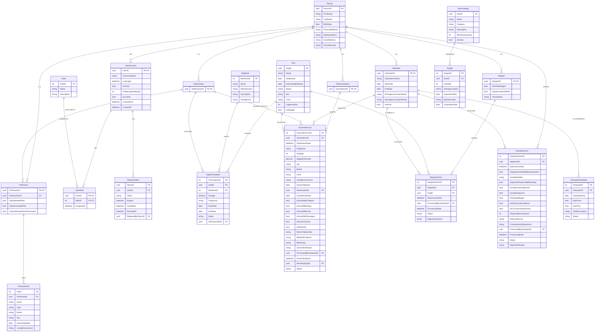

```mermaid
erDiagram
    Person ||--o{ Adopter : "is a"
    Person ||--o{ Volunteer : "is a"
    Person ||--o{ PetOwner : "is a"
    Person ||--o{ PetSurrenderer : "is a"
    Person ||--o{ Veterinarian : "is a"
    Person ||--o{ UserAccount : "has"

    UserAccount ||--o{ UserRole : "has"
    UserAccount ||--o{ RefreshToken : "has"
    Role ||--o{ UserRole : "assigned to"
    
    Dog ||--o{ DogPrescription : "receives"
    Medicine ||--o{ DogPrescription : "used in"
    Veterinarian ||--o{ DogPrescription : "prescribes"
    
    ItemCatalog ||--o{ Supply : "categorizes"
    
    PetOwner ||--o{ PetOwnerPet : "owns"
    Veterinarian ||--o{ PetOwner : "treats pets of"
    
    PetSurrenderer ||--o{ SurrenderForm : "submits"
    Volunteer ||--o{ SurrenderForm : "processes"
    Veterinarian ||--o{ SurrenderForm : "provides history for"
    Dog ||--o{ SurrenderForm : "results from"
    
    Adopter ||--o{ AdoptionForm : "submits"
    Dog ||--o{ AdoptionForm : "is subject of"
    Volunteer ||--o{ AdoptionForm : "processes"
    
    Person ||--o{ VolunteerForm : "submits"
    Volunteer ||--o{ VolunteerForm : "processes"
    
    Volunteer ||--o{ VolunteerSchedule : "is scheduled for"
    
    Person {
        uuid PersonID PK
        string FirstName
        string LastName
        date BirthDate
        string PhysicalAddress
        string MailingAddress
        string EmailAddress
        string PhoneNumber
    }
    
    Adopter {
        uuid AdopterID PK, FK
        bool HasPetAllergies
        bool HasSurrenderedPets
        string HomeStatus
    }
    
    Volunteer {
        uuid VolunteerID PK, FK
        string VolunteerPosition
        date StartDate
        date EndDate
        string EmergencyContactName
        string EmergencyContactPhone
        bool IsActive
    }
    
    PetOwner {
        uuid PetOwnerID PK, FK
        uuid VeterinarianID FK
        bool HasSterilizedPets
        bool HasVaccinatedPets
        bool UsesVetHeartWormPrevention
    }
    
    PetSurrenderer {
        uuid SurrendererID PK, FK
    }
    
    Veterinarian {
        uuid VeterinarianID PK, FK
    }
    
    Dog {
        uuid DogID PK
        string Name
        date IntakeDate
        date EstimatedBirthDate
        string Breed
        string Sex
        string Color
        int CageNumber
        bool IsAdopted
    }
    
    Medicine {
        int MedicineID PK
        string Name
        string Manufacturer
        string Description
        string DosageUnit
    }
    
    DogPrescription {
        int PrescriptionID PK
        uuid DogID FK
        int MedicineID FK
        decimal Dosage
        string Frequency
        date StartDate
        date EndDate
        string Notes
        uuid VetPrescriberID FK
    }
    
    ItemCatalog {
        uuid ItemID PK
        string Name
        string Category
        string Description
        int MinimumQuantity
        bool IsActive
    }
    
    Supply {
        int SupplyID PK
        uuid ItemID FK
        int Quantity
        string StorageLocation
        date ExpirationDate
        string BatchNumber
        date AcquisitionDate
    }
    
    PetOwnerPet {
        int PetID PK
        uuid PetOwnerID FK
        string Name
        string Type
        string Breed
        string Sex
        date OwnershipDate
        string LivingEnvironment
    }
    
    SurrenderForm {
        int SurrenderFormID PK
        uuid SurrendererID FK
        datetime SubmissionDate
        string DogName
        int DogAge
        decimal WeightInPounds
        string Sex
        string Breed
        string Color
        string LivingEnvironment
        date OwnershipDate
        uuid VeterinarianID FK
        date LastVetVisitDate
        bool IsGoodWithChildren
        bool IsGoodWithDogs
        bool IsGoodWithCats
        bool IsGoodWithStrangers
        bool IsHouseTrained
        bool IsSterilized
        string MicroChipNumber
        string MedicalProblems
        string BiteHistory
        string SurrenderReason
        uuid ProcessedByVolunteerID FK
        datetime ProcessingDate
        uuid ResultingDogID FK
        string Status
    }
    
    AdoptionForm {
        int AdoptionFormID PK
        uuid AdopterID FK
        uuid DogID FK
        datetime SubmissionDate
        uuid ProcessedByVolunteerID FK
        datetime ProcessingDate
        string Status
        string RejectionReason
    }
    
    VolunteerForm {
        int VolunteerFormID PK
        uuid ApplicantID FK
        datetime SubmissionDate
        bool SupportsAnimalWelfareEducation
        string AvailableShifts
        bool SupportsResponsibleBreeding
        bool AcceptsCleaningDuties
        bool AcceptsDogCare
        bool HasDogAllergies
        bool HasPhysicalLimitations
        bool IsForCommunityService
        int RequiredServiceHours
        string ReferralSource
        string CommentsAndQuestions
        uuid ProcessedByVolunteerID FK
        datetime ProcessingDate
        string Status
        string RejectionReason
    }
    
    VolunteerSchedule {
        int ScheduleID PK
        uuid VolunteerID FK
        date ScheduleDate
        time StartTime
        time EndTime
        string TaskDescription
        string Status
    }
    
    UserAccount {
        uuid UserID PK, FK
        string PasswordHash
        datetime LastLogin
        bool IsActive
        int FailedLoginAttempts
        bool IsLocked
        datetime LockoutEnd
        datetime CreatedAt
    }
    
    Role {
        int RoleID PK
        string Name
        string Description
    }
    
    UserRole {
        uuid UserID PK, FK
        int RoleID PK, FK
        datetime AssignedAt
    }
    
    RefreshToken {
        uuid TokenID PK
        uuid UserID FK
        string Token
        datetime Expires
        datetime CreatedAt
        datetime RevokedAt
        uuid ReplacedByTokenID FK
    }
```